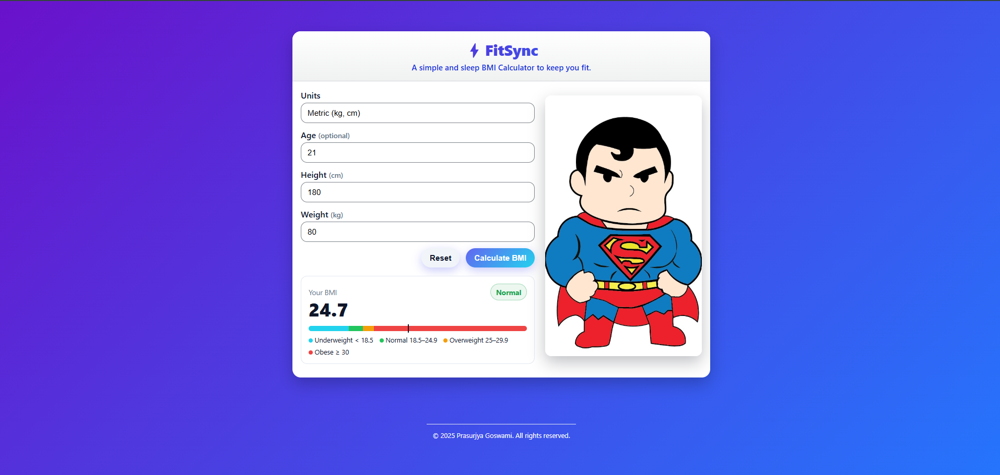

<h1>FitSync – BMI Calculator</h1>

A modern Body Mass Index (BMI) Calculator built with HTML, CSS, and JavaScript. It supports Metric (kg/cm) and Imperial (lb/in) units, works entirely in the browser (no data leaves your device), and features a clean, responsive design with gradient backgrounds and illustrations.

✨ Features

✅ Metric (kg, cm) and Imperial (lb, in) unit support

⚡ Instant BMI calculation in the browser (no network calls)

🎯 Clear BMI category (Underweight, Normal, Overweight, Obese)

🎨 Modern UI: smooth gradient background, compact card layout, and illustration on the right

📱 Responsive: stacks on mobile, two-column layout on wider screens

♻️ Reset button to clear inputs quickly

♿ Accessible basics: labeled controls and live result region

🛠 Tech stack

HTML5 — structure

CSS3 — modern gradients, responsive layout, compact styling

JavaScript (Vanilla) — form handling and BMI logic
